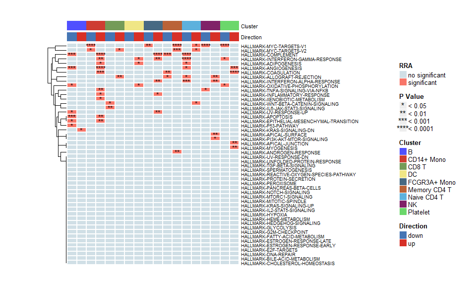

<!-- README.md is generated from README.Rmd. Please edit that file -->

# irGSEA

<!-- badges: start -->
<!-- badges: end -->

Integrate all single cell rank-based gene set enrichment analysis and
easy to visualize the results.

For more details, please view
[irGSEA](https://chuiqin.github.io/irGSEA/)

## Installation

## load example dataset

load PBMC dataset by R package SeuratData

``` r
# devtools::install_github('satijalab/seurat-data')
library(SeuratData)
# view all available datasets
View(AvailableData())
# download 3k PBMCs from 10X Genomics
InstallData("pbmc3k")
# the details of pbmc3k.final
?pbmc3k.final
```

``` r
library(Seurat)
library(SeuratData)
library(IOBR)
# loading dataset
data("pbmc3k.final")
pbmc3k.final <- UpdateSeuratObject(pbmc3k.final)
# plot
DimPlot(pbmc3k.final, reduction = "umap",
        group.by = "seurat_annotations",label = T) + NoLegend()+ design_mytheme()
```


``` r
# set cluster to idents
Idents(pbmc3k.final) <- pbmc3k.final$seurat_annotations
```

## Load library

``` r
library(UCell)
library(irGSEA)
```

## Calculate enrichment scores

calculate enrichment scores, return a Seurat object including these
score matrix

Error (Valid ‘mctype’: ‘snow’ or ‘doMC’) occurs when ncore &gt; 1 :
please ensure the version of AUCell &gt;= 1.14 or set ncore = 1.

``` r
pbmc3k.final <- irGSEA.score(object         = pbmc3k.final, 
                             assay          = "RNA", 
                             slot           = "scale.data", 
                             seeds          = 123,
                             ncores         = 1,
                             min.cells      = 3, 
                             min.feature    = 0,
                             custom         = F, 
                             geneset        = NULL,
                             msigdb         = T, 
                             species        = "Homo sapiens", 
                             category       = "H",  
                             subcategory    = NULL, 
                             geneid         = "symbol",
                             method         = c("AUCell", "UCell", "singscore", "ssgsea","PCAscore"),
                             aucell.MaxRank = NULL, 
                             ucell.MaxRank  = NULL, 
                             kcdf           = 'Gaussian')
#> Validating object structure
#> Updating object slots
#> Ensuring keys are in the proper strucutre
#> Ensuring feature names don't have underscores or pipes
#> Object representation is consistent with the most current Seurat version
#> >>>--- Calculate AUCell scores
#> Warning: Feature names cannot have underscores ('_'), replacing with dashes
#> ('-')

#> Warning: Feature names cannot have underscores ('_'), replacing with dashes
#> ('-')
#> >>>---Finish calculate AUCell scores
#> --------------------------------------
#> >>>--- Calculate UCell scores
#> Warning in if (class(matrix) != "dgCMatrix") {: 条件的长度大于一，因此只能用其第
#> 一元素

#> Warning in if (class(matrix) != "dgCMatrix") {: Feature names cannot have
#> underscores ('_'), replacing with dashes ('-')

#> Warning in if (class(matrix) != "dgCMatrix") {: Feature names cannot have
#> underscores ('_'), replacing with dashes ('-')
#> >>>--- Finish calculate UCell scores
#> --------------------------------------
#> >>>--- Calculate singscore scores
#> Warning: Feature names cannot have underscores ('_'), replacing with dashes
#> ('-')

#> Warning: Feature names cannot have underscores ('_'), replacing with dashes
#> ('-')
#> >>>--- Finish calculate singscore scores
#> --------------------------------------
#> >>>--- Calculate ssgsea scores
#> Warning in .filterFeatures(expr, method): 1 genes with constant expression
#> values throuhgout the samples.

#> Warning in .filterFeatures(expr, method): Feature names cannot have underscores
#> ('_'), replacing with dashes ('-')

#> Warning in .filterFeatures(expr, method): Feature names cannot have underscores
#> ('_'), replacing with dashes ('-')
#> >>>--- Finish calculate ssgsea scores
#> --------------------------------------
#> >>>--- Calculate PCA scores
#> Warning: In prcomp.default(t(eset), na.action = na.omit, scale. = T) :
#>  extra argument 'na.action' will be disregarded
#> Warning: In prcomp.default(t(eset), na.action = na.omit, scale. = T) :
#>  extra argument 'na.action' will be disregarded

#> Warning: In prcomp.default(t(eset), na.action = na.omit, scale. = T) :
#>  extra argument 'na.action' will be disregarded

#> Warning: In prcomp.default(t(eset), na.action = na.omit, scale. = T) :
#>  extra argument 'na.action' will be disregarded

#> Warning: In prcomp.default(t(eset), na.action = na.omit, scale. = T) :
#>  extra argument 'na.action' will be disregarded

#> Warning: In prcomp.default(t(eset), na.action = na.omit, scale. = T) :
#>  extra argument 'na.action' will be disregarded

#> Warning: In prcomp.default(t(eset), na.action = na.omit, scale. = T) :
#>  extra argument 'na.action' will be disregarded

#> Warning: In prcomp.default(t(eset), na.action = na.omit, scale. = T) :
#>  extra argument 'na.action' will be disregarded

#> Warning: In prcomp.default(t(eset), na.action = na.omit, scale. = T) :
#>  extra argument 'na.action' will be disregarded

#> Warning: In prcomp.default(t(eset), na.action = na.omit, scale. = T) :
#>  extra argument 'na.action' will be disregarded

#> Warning: In prcomp.default(t(eset), na.action = na.omit, scale. = T) :
#>  extra argument 'na.action' will be disregarded

#> Warning: In prcomp.default(t(eset), na.action = na.omit, scale. = T) :
#>  extra argument 'na.action' will be disregarded

#> Warning: In prcomp.default(t(eset), na.action = na.omit, scale. = T) :
#>  extra argument 'na.action' will be disregarded

#> Warning: In prcomp.default(t(eset), na.action = na.omit, scale. = T) :
#>  extra argument 'na.action' will be disregarded

#> Warning: In prcomp.default(t(eset), na.action = na.omit, scale. = T) :
#>  extra argument 'na.action' will be disregarded

#> Warning: In prcomp.default(t(eset), na.action = na.omit, scale. = T) :
#>  extra argument 'na.action' will be disregarded

#> Warning: In prcomp.default(t(eset), na.action = na.omit, scale. = T) :
#>  extra argument 'na.action' will be disregarded

#> Warning: In prcomp.default(t(eset), na.action = na.omit, scale. = T) :
#>  extra argument 'na.action' will be disregarded

#> Warning: In prcomp.default(t(eset), na.action = na.omit, scale. = T) :
#>  extra argument 'na.action' will be disregarded

#> Warning: In prcomp.default(t(eset), na.action = na.omit, scale. = T) :
#>  extra argument 'na.action' will be disregarded

#> Warning: In prcomp.default(t(eset), na.action = na.omit, scale. = T) :
#>  extra argument 'na.action' will be disregarded

#> Warning: In prcomp.default(t(eset), na.action = na.omit, scale. = T) :
#>  extra argument 'na.action' will be disregarded

#> Warning: In prcomp.default(t(eset), na.action = na.omit, scale. = T) :
#>  extra argument 'na.action' will be disregarded

#> Warning: In prcomp.default(t(eset), na.action = na.omit, scale. = T) :
#>  extra argument 'na.action' will be disregarded

#> Warning: In prcomp.default(t(eset), na.action = na.omit, scale. = T) :
#>  extra argument 'na.action' will be disregarded

#> Warning: In prcomp.default(t(eset), na.action = na.omit, scale. = T) :
#>  extra argument 'na.action' will be disregarded

#> Warning: In prcomp.default(t(eset), na.action = na.omit, scale. = T) :
#>  extra argument 'na.action' will be disregarded

#> Warning: In prcomp.default(t(eset), na.action = na.omit, scale. = T) :
#>  extra argument 'na.action' will be disregarded

#> Warning: In prcomp.default(t(eset), na.action = na.omit, scale. = T) :
#>  extra argument 'na.action' will be disregarded

#> Warning: In prcomp.default(t(eset), na.action = na.omit, scale. = T) :
#>  extra argument 'na.action' will be disregarded

#> Warning: In prcomp.default(t(eset), na.action = na.omit, scale. = T) :
#>  extra argument 'na.action' will be disregarded

#> Warning: In prcomp.default(t(eset), na.action = na.omit, scale. = T) :
#>  extra argument 'na.action' will be disregarded

#> Warning: In prcomp.default(t(eset), na.action = na.omit, scale. = T) :
#>  extra argument 'na.action' will be disregarded

#> Warning: In prcomp.default(t(eset), na.action = na.omit, scale. = T) :
#>  extra argument 'na.action' will be disregarded

#> Warning: In prcomp.default(t(eset), na.action = na.omit, scale. = T) :
#>  extra argument 'na.action' will be disregarded

#> Warning: In prcomp.default(t(eset), na.action = na.omit, scale. = T) :
#>  extra argument 'na.action' will be disregarded

#> Warning: In prcomp.default(t(eset), na.action = na.omit, scale. = T) :
#>  extra argument 'na.action' will be disregarded

#> Warning: In prcomp.default(t(eset), na.action = na.omit, scale. = T) :
#>  extra argument 'na.action' will be disregarded

#> Warning: In prcomp.default(t(eset), na.action = na.omit, scale. = T) :
#>  extra argument 'na.action' will be disregarded

#> Warning: In prcomp.default(t(eset), na.action = na.omit, scale. = T) :
#>  extra argument 'na.action' will be disregarded

#> Warning: In prcomp.default(t(eset), na.action = na.omit, scale. = T) :
#>  extra argument 'na.action' will be disregarded

#> Warning: In prcomp.default(t(eset), na.action = na.omit, scale. = T) :
#>  extra argument 'na.action' will be disregarded

#> Warning: In prcomp.default(t(eset), na.action = na.omit, scale. = T) :
#>  extra argument 'na.action' will be disregarded

#> Warning: In prcomp.default(t(eset), na.action = na.omit, scale. = T) :
#>  extra argument 'na.action' will be disregarded

#> Warning: In prcomp.default(t(eset), na.action = na.omit, scale. = T) :
#>  extra argument 'na.action' will be disregarded

#> Warning: In prcomp.default(t(eset), na.action = na.omit, scale. = T) :
#>  extra argument 'na.action' will be disregarded

#> Warning: In prcomp.default(t(eset), na.action = na.omit, scale. = T) :
#>  extra argument 'na.action' will be disregarded

#> Warning: In prcomp.default(t(eset), na.action = na.omit, scale. = T) :
#>  extra argument 'na.action' will be disregarded

#> Warning: In prcomp.default(t(eset), na.action = na.omit, scale. = T) :
#>  extra argument 'na.action' will be disregarded

#> Warning: In prcomp.default(t(eset), na.action = na.omit, scale. = T) :
#>  extra argument 'na.action' will be disregarded
#>                HALLMARK_ADIPOGENESIS HALLMARK_ALLOGRAFT_REJECTION
#> AAACATACAACCAC            -2.0836065                    -3.536539
#> AAACATTGAGCTAC             0.3171101                     3.410572
#> AAACATTGATCAGC             1.0748024                    -3.455677
#> AAACCGTGCTTCCG             1.7233565                     3.884758
#> AAACCGTGTATGCG            -1.7107910                    -2.429350
#>                HALLMARK_ANDROGEN_RESPONSE HALLMARK_ANGIOGENESIS
#> AAACATACAACCAC                 -0.4784224            -0.6170896
#> AAACATTGAGCTAC                 -0.2221773            -1.9103718
#> AAACATTGATCAGC                  1.9449294            -0.5253560
#> AAACCGTGCTTCCG                 -1.1527247             1.5025361
#> AAACCGTGTATGCG                  2.8965137            -0.6519490
#>                HALLMARK_APICAL_JUNCTION
#> AAACATACAACCAC              -0.07358956
#> AAACATTGAGCTAC               1.00431328
#> AAACATTGATCAGC               0.10139119
#> AAACCGTGCTTCCG               1.67354038
#> AAACCGTGTATGCG               1.47968479
#> Warning: Feature names cannot have underscores ('_'), replacing with dashes
#> ('-')
#> Warning: Feature names cannot have underscores ('_'), replacing with dashes
#> ('-')
#> >>>--- Finish calculate PCA scores
#> --------------------------------------
Seurat::Assays(pbmc3k.final)
#> [1] "RNA"       "AUCell"    "UCell"     "singscore" "ssgsea"    "PCAscore"
```

## Integrate differential gene set

Wlicox test is perform to all enrichment score matrixes and gene sets
with adjusted p value &lt; 0.05 are used to integrated through RRA.
Among them, Gene sets with p value &lt; 0.05 are statistically
significant and common differential in all gene sets enrichment analysis
methods. All results are saved in a list.

``` r
result.dge <- irGSEA.integrate(object   = pbmc3k.final, 
                               group.by = "seurat_annotations",
                               metadata = NULL, 
                               col.name = NULL,
                               method   = c("AUCell","UCell","singscore", "ssgsea","PCAscore"))
#> Calculate differential gene set : AUCell
#> Calculate differential gene set : UCell
#> Calculate differential gene set : singscore
#> Calculate differential gene set : ssgsea
#> Calculate differential gene set : PCAscore
class(result.dge)
#> [1] "list"
```

## Visualization

### 1. Global show

### heatmap plot

Show co-upregulated or co-downregulated gene sets per cluster in RRA

``` r
irGSEA.heatmap.plot <- irGSEA.heatmap(object       = result.dge, 
                                      method       = "RRA",
                                      top          = 50, 
                                      show.geneset = NULL)
irGSEA.heatmap.plot
```



### Bubble.plot

Show co-upregulated or co-downregulated gene sets per cluster in RRA.

If error (argument “caller\_env” is missing, with no default) occurs :
please uninstall ggtree and run
“remotes::install\_github(”YuLab-SMU/ggtree“)”.

``` r
irGSEA.bubble.plot <- irGSEA.bubble(object = result.dge, 
                                    method = "RRA", 
                                    top    = 50)
irGSEA.bubble.plot
```


### upset plot

Show the intersections of significant gene sets among clusters in RRA

Don’t worry if warning happens : the condition has length &gt; 1 and
only the first element will be used. It’s ok.

``` r
irGSEA.upset.plot <- irGSEA.upset(object = result.dge, 
                                  method = "RRA")
#> Warning in if (as.character(ta_call[[1]]) == "upset_top_annotation") {: 条件的长
#> 度大于一，因此只能用其第一元素
irGSEA.upset.plot
```


### Stacked bar plot

Show the intersections of significant gene sets among clusters in all
methods

``` r
# irGSEA.barplot.plot <- irGSEA.barplot(object = result.dge,
#                                       method = c("AUCell", "UCell", "singscore","ssgsea","PCAscore"))
# irGSEA.barplot.plot
```

### 2. local show

Show the expression and distribution of special gene sets in special
gene set enrichment analysis method

### density scatterplot

Show the expression and distribution of “HALLMARK-INFLAMMATORY-RESPONSE”
in Ucell on UMAP plot.

``` r
scatterplot1 <- irGSEA.density.scatterplot(object = pbmc3k.final,
                             method = "UCell",
                             show.geneset = "HALLMARK-INFLAMMATORY-RESPONSE",
                             reduction = "umap")


scatterplot2 <- irGSEA.density.scatterplot(object = pbmc3k.final,
                             method = "PCAscore",
                             show.geneset = "HALLMARK-INFLAMMATORY-RESPONSE",
                             reduction = "umap")
#> Warning in ks.defaults(x = x, w = w, binned = binned, bgridsize = bgridsize, : Weights don't sum to sample size - they have been scaled accordingly
scatterplot1 + scatterplot2
```


### half vlnplot

Show the expression and distribution of “HALLMARK-INFLAMMATORY-RESPONSE”
in Ucell among clusters.

``` r
halfvlnplot1 <- irGSEA.halfvlnplot(object = pbmc3k.final,
                                  method = "UCell",
                                  show.geneset = "HALLMARK-INFLAMMATORY-RESPONSE")
halfvlnplot2 <- irGSEA.halfvlnplot(object = pbmc3k.final,
                                  method = "PCAscore",
                                  show.geneset = "HALLMARK-INFLAMMATORY-RESPONSE")
halfvlnplot1+halfvlnplot2
```


### ridge plot

Show the expression and distribution of “HALLMARK-INFLAMMATORY-RESPONSE”
in Ucell among clusters.

``` r
ridgeplot1 <- irGSEA.ridgeplot(object = pbmc3k.final,
                              method = "UCell",
                              show.geneset = "HALLMARK-INFLAMMATORY-RESPONSE")

ridgeplot2 <- irGSEA.ridgeplot(object = pbmc3k.final,
                              method = "PCAscore",
                              show.geneset = "HALLMARK-INFLAMMATORY-RESPONSE")
ridgeplot1+ridgeplot2
#> Picking joint bandwidth of 0.00502
#> Picking joint bandwidth of 0.337
```


### density heatmap

Show the expression and distribution of “HALLMARK-INFLAMMATORY-RESPONSE”
in Ucell among clusters.

``` r
densityheatmap1 <- irGSEA.densityheatmap(object = pbmc3k.final,
                                        method = "UCell",
                                        show.geneset = "HALLMARK-INFLAMMATORY-RESPONSE")
densityheatmap1
```


``` r
densityheatmap2 <- irGSEA.densityheatmap(object = pbmc3k.final,
                                        method = "PCAscore",
                                        show.geneset = "HALLMARK-INFLAMMATORY-RESPONSE")
densityheatmap2
```


``` r
densityheatmap1+densityheatmap2
```


